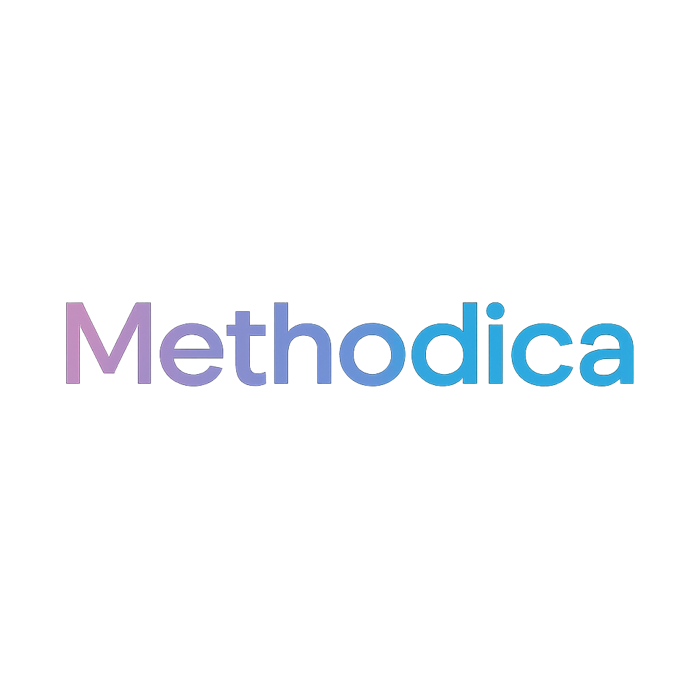

  

  <strong>Personal Productivity App. Organize Your Life, Achieve Your Goals</strong> 

---

## Disponibilità / Availability

  
  

| Platform | Status |
|----------|--------|
| **iOS** | 🔄 Under review on App Store / In revisione su App Store |
| **Android** | 🔄 Under review on Google Play Store / In revisione su Google Play Store |

---

  

## Perché Methodica? / Why Methodica?

**🇮🇹 Italiano:**  
Ho creato Methodica perché non riuscivo a trovare un'app per la gestione degli appuntamenti e della produttività che funzionasse davvero per me. Dopo aver provato numerose soluzioni esistenti, ho deciso di costruire qualcosa che rispondesse esattamente alle mie esigenze: un sistema completo che integrasse calendario, task management e bilanciamento delle priorità di vita in un'unica interfaccia intuitiva.

Se anche tu la trovi utile, fantastico! Se invece trovi qualcosa che non funziona come dovrebbe o hai idee su come migliorarla, ti invito ad aprire un'issue. Questo progetto nasce dalla community e per la community.

**🇬🇧 English:**  
I created Methodica because I couldn't find an appointment and productivity management app that truly worked for me. After trying numerous existing solutions, I decided to build something that met exactly my needs: a complete system that integrates calendar, task management, and life priority balancing in a single intuitive interface.

If you find it useful too, that's great! If instead you find something that doesn't work as it should or have ideas on how to improve it, please open an issue. This project comes from the community and is for the community.

---

## Panoramica / Overview

**🇮🇹 Italiano:**  
Methodica è un'applicazione mobile completa per la gestione della produttività personale, progettata per aiutare gli utenti a organizzare eventi, gestire attività e bilanciare le priorità della vita attraverso un'interfaccia intuitiva e potente.

**🇬🇧 English:**  
Methodica is a complete mobile application for personal productivity management, designed to help users organize events, manage tasks, and balance life's priorities through an intuitive and powerful interface.

---

## Caratteristiche Principali / Key Features

**🇮🇹** L'applicazione è costruita attorno a diversi moduli integrati per offrire un'esperienza completa di gestione del tempo a 360 gradi.

**🇬🇧** The application is built around several integrated modules to offer a comprehensive, 360-degree time management experience.

---

### Gestione Eventi e Calendario / Event & Calendar Management

**🇮🇹 Italiano:**
- **CRUD Completo per Eventi**: Crea, modifica, visualizza ed elimina eventi
- **Calendario Multi-Vista**: Visualizza eventi in modalità giornaliera (con timeline oraria), settimanale e mensile
- **Supporto Eventi Interi Giorni**: Supporto per eventi che durano l'intera giornata
- **Riprogrammazione Automatica**: Gli eventi passati e non completati possono essere automaticamente riprogrammati al giorno corrente
- **Promemoria Personalizzabili**: Imposta notifiche multiple per ogni evento (es. al momento dell'evento, 5 minuti prima, 1 ora prima, ecc.)
- **Personalizzazione**: Assegna icone e colori personalizzati a ogni evento

**🇬🇧 English:**
- **Full CRUD for Events**: Create, edit, view, and delete events
- **Multi-View Calendar**: View events in daily (with hourly timeline), weekly, and monthly modes
- **All-Day Event Support**: Support for events that last the entire day
- **Automatic Rescheduling**: Past, uncompleted events can be automatically rescheduled to the current day
- **Customizable Reminders**: Set multiple notifications for each event (e.g., at the time of the event, 5 minutes before, 1 hour before, etc.)
- **Personalization**: Assign custom icons and colors to each event

---

### Gestione Task e Kanban / Task & Kanban Management

**🇮🇹 Italiano:**
- **Bacheca Kanban**: Le attività sono organizzate in colonne (Backlog, In Progress, Review, Done) per una gestione visuale del workflow
- **Dettagli Task**: Ogni task può avere una descrizione, priorità (alta, media, bassa), scadenza, icone, sub-task e tag
- **Filtri Avanzati**: La vista Kanban può essere filtrata per "Area di Priorità", mostrando solo i task pertinenti
- **Notifiche Giornaliere**: Promemoria quotidiani (mattina e sera) per i task attivi (In Progress e Review)

**🇬🇧 English:**
- **Kanban Board**: Tasks are organized into columns (Backlog, In Progress, Review, Done) for visual workflow management
- **Task Details**: Each task can have a description, priority (high, medium, low), deadline, icons, sub-tasks, and tags
- **Advanced Filtering**: The Kanban view can be filtered by "Priority Area," showing only relevant tasks
- **Daily Notifications**: Daily reminders (morning and evening) for active tasks (In Progress and Review)

---

### Quadrato delle Priorità / Priority Square

**🇮🇹 Italiano:**
- **Bilanciamento delle Aree di Vita**: Gli utenti possono definire aree importanti della propria vita (es. Lavoro, Salute, Famiglia) e assegnare una percentuale di importanza a ciascuna
- **Visualizzazione Treemap**: Le aree sono mostrate come un quadrato dinamico (treemap) che rappresenta visivamente il loro "peso"
- **Collegamento Task/Eventi**: I task e gli eventi possono essere collegati a un'area specifica, aiutando l'utente a dedicare tempo alle cose giuste

**🇬🇧 English:**
- **Life Area Balancing**: Users can define important areas of their life (e.g., Work, Health, Family) and assign a percentage of importance to each
- **Treemap Visualization**: The areas are displayed as a dynamic square (treemap) that visually represents their "weight"
- **Task/Event Linking**: Tasks and events can be linked to a specific area, helping the user to dedicate time to the right things

---

### Dashboard (Schermata Principale / Home Screen)

**🇮🇹 Italiano:**
- **Panoramica Giornaliera**: Mostra un riepilogo del giorno corrente con la data, gli eventi programmati e i task attivi
- **Progresso Giornaliero**: Una barra di progresso mostra la percentuale di eventi completati durante il giorno
- **Accesso Rapido**: Pulsanti per aggiungere rapidamente nuovi eventi o task

**🇬🇧 English:**
- **Daily Overview**: Shows a summary of the current day with the date, scheduled events, and active tasks
- **Daily Progress**: A progress bar shows the percentage of events completed during the day
- **Quick Access**: Buttons to quickly add new events or tasks

---

### Impostazioni e Personalizzazione / Settings & Customization

**🇮🇹 Italiano:**
- **Tema Dark/Light/Auto**: L'app supporta temi multipli che possono anche adattarsi automaticamente alle impostazioni di sistema
- **Gestione Notifiche**: Abilita o disabilita globalmente le notifiche dall'app
- **Gestione Dati**: Funzionalità per eliminare tutti i dati, o solo eventi/task, per ricominciare da zero

**🇬🇧 English:**
- **Dark/Light/Auto Theme**: The app supports multiple themes that can also automatically adapt to system settings
- **Notification Management**: Globally enable or disable notifications from the app
- **Data Management**: Functionality to delete all data, or just events/tasks, to start over

---

### Internazionalizzazione (i18n) / Internationalization

**🇮🇹 Italiano:**
- **Supporto Multi-lingua**: L'interfaccia è tradotta in più lingue (Italiano, Inglese, Francese, Tedesco, Spagnolo) e si adatta automaticamente alla lingua del dispositivo
- **Localizzazione Date**: Date e orari sono formattati correttamente in base alla lingua rilevata

**🇬🇧 English:**
- **Multi-language Support**: The interface is translated into multiple languages (Italian, English, French, German, Spanish) and automatically adapts to the device's language
- **Date Localization**: Dates and times are formatted correctly based on the detected language

---

## Tecnologie Utilizzate / Technologies Used

**🇮🇹** L'applicazione è stata costruita utilizzando **React Native** con il framework **Expo**.

**🇬🇧** The application was built using **React Native** with the **Expo** framework.

---

### Framework Core / Core Framework

**🇮🇹 Italiano:**
- **React Native**: Per lo sviluppo di applicazioni cross-platform (iOS & Android)
- **Expo**: Per semplificare lo sviluppo, il building e l'accesso alle API native

**🇬🇧 English:**
- **React Native**: For cross-platform application development (iOS & Android)
- **Expo**: To simplify development, building, and access to native APIs

---

### Navigazione / Navigation

**🇮🇹 Italiano:**
- **React Navigation** (`@react-navigation/native`, `@react-navigation/bottom-tabs`): Per gestire la navigazione basata su tab (Tab Navigator) tra le schermate principali

**🇬🇧 English:**
- **React Navigation** (`@react-navigation/native`, `@react-navigation/bottom-tabs`): To manage tab-based navigation (Tab Navigator) between main screens

---

### Gestione dello Stato / State Management

**🇮🇹 Italiano:**
- **React Context API**: Per gestire lo stato globale dell'applicazione (eventi, task, impostazioni, tema) in modo centralizzato e reattivo attraverso `AppContext` e `ThemeContext`

**🇬🇧 English:**
- **React Context API**: To manage the application's global state (events, tasks, settings, theme) in a centralized and reactive way through `AppContext` and `ThemeContext`

---

### UI & Componenti / UI & Components

**🇮🇹 Italiano:**
- **React Native Core Components**: Componenti base per costruire l'interfaccia utente
- **`@expo/vector-icons`**: Per una vasta libreria di icone personalizzabili
- **`react-native-gesture-handler`**: Per gestire gesture complesse e interazioni touch
- **`react-native-safe-area-context`**: Per gestire correttamente i layout su dispositivi con notch e safe area
- **`react-native-calendars`**: Utilizzato per la vista calendario mensile
- **`@react-native-community/slider`**: Per il componente slider utilizzato nella definizione delle percentuali delle aree
- **`@react-native-community/datetimepicker`**: Per i picker nativi di data e ora
- **`expo-linear-gradient`**: Per creare gradienti di colore in alcuni componenti UI

**🇬🇧 English:**
- **React Native Core Components**: Base components for building the user interface
- **`@expo/vector-icons`**: For a vast library of customizable icons
- **`react-native-gesture-handler`**: To handle complex gestures and touch interactions
- **`react-native-safe-area-context`**: To properly manage layouts on devices with notch and safe area
- **`react-native-calendars`**: Used for the monthly calendar view
- **`@react-native-community/slider`**: For the slider component used in defining area percentages
- **`@react-native-community/datetimepicker`**: For native date and time pickers
- **`expo-linear-gradient`**: To create color gradients in some UI components

---

### Archiviazione Locale / Local Storage

**🇮🇹 Italiano:**
- **`@react-native-async-storage/async-storage`**: Per persistere i dati utente (eventi, task, aree, impostazioni) direttamente sul dispositivo

**🇬🇧 English:**
- **`@react-native-async-storage/async-storage`**: To persist user data (events, tasks, areas, settings) directly on the device

---

### API Native & Servizi / Native APIs & Services

**🇮🇹 Italiano:**
- **`expo-notifications`**: Per la gestione completa delle notifiche locali (richiesta permessi, scheduling, cancellazione)
- **`expo-splash-screen`**: Per il controllo programmatico della splash screen
- **`expo-localization`**: Per rilevare la lingua e le impostazioni regionali del dispositivo

**🇬🇧 English:**
- **`expo-notifications`**: For complete local notification management (permission requests, scheduling, cancellation)
- **`expo-splash-screen`**: For programmatic control of the splash screen
- **`expo-localization`**: To detect the device's language and regional settings

---

### Utilità / Utilities

**🇮🇹 Italiano:**
- **`date-fns`**: Una libreria moderna e potente per manipolare e formattare date e orari
- **`i18next` & `react-i18next`**: Per implementare l'internazionalizzazione

**🇬🇧 English:**
- **`date-fns`**: A modern and powerful library for manipulating and formatting dates and times
- **`i18next` & `react-i18next`**: To implement internationalization

---

## 🤝 Contributi / Contributing

**🇮🇹** I contributi sono benvenuti! Sentiti libero di aprire issue o pull request.

**🇬🇧** Contributions are welcome! Feel free to open issues or pull requests.

---

## Contatti / Contact

**🇮🇹** Per domande o supporto, contatta: [giacomoleonemariadev@gmail.com](mailto:giacomoleonemariadev@gmail.com), o apri una Issue su GitHub.

**🇬🇧** For questions or support, contact: [giacomoleonemariadev@gmail.com](mailto:giacomoleonemariadev@gmail.com), or open as Issue on GitHub.

---

  Made with ❤️ by Giacomo Cavallini

